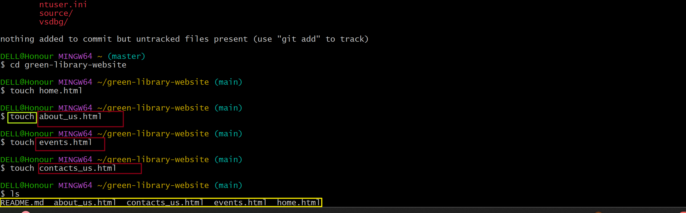
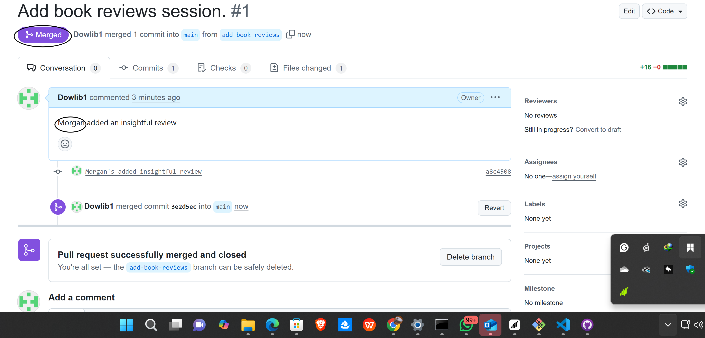

This is a capstone project for Green-Library-website.

## Step-by-Step Collaboration Guide: Mainbranch, Morgan, and Jamie

This project was developed collaboratively by Mainbranch, Morgan, and Jamie. Below is a detailed, step-by-step guide documenting our workflow, illustrated with screenshots from the `greenlibrary` folder.

### 1. Repository Setup and Cloning

- All collaborators cloned the repository to their local machines.
    

### Create repository and add a README.md file (optional) . and SAVE 

- Morgan and Jamie created their own feature branches for isolated development.
    
    
     
### Step C. 

- Make the repo public.
    
    

## Step D. 
- Main branch-Clone the repository locally using Gitbash using git clone <https://github.com/Dowlib1/green-library-website>
    
## Step E
- Create about_us.html, events.html, home.html,contact_us.html using touch <name.html> and using <cd <directory>> to navigate within green-library-website
  
   

   ## Step F

- Use <code .> to modify html files in VScode or other environment of your choice add random content to each html files press ctrl s to save
    
    - Add content to the html files
    

## Step G Navigate back to git bash and 

- Use the following command
git status 
git add .
git commit -m "write a commit message"
git push origin main
    
    
    

### 2. Morgan Branching 

- Morgan created feature branches for isolated development.
Using git branch <add-book-reviews>
    
- git <checkout add-book-reviews> to switch to Morgan's branch
   
- 
- Each collaborator set up the project environment and installed dependencies.
    
   - [Morgan added content](greenlibrary/morgan13.png)

### 4. Feature Development

- Morgan and Jamie worked on their respective features, making incremental commits.
    
   
## Step G Navigate back to git bash and 

- Use the following command
git status 
git add .
git commit -m "write a commit message"
git push origin add-book-reviews
    
    

    

### 6. Pushing Changes

- Changes were pushed to the remote repository on their respective branches.
    
    
### 7. Pull Request Creation

- Morgan opened pull requests to merge into the main branch.
    
    
   

### 8. Code Review

- Mainbranch reviewed the pull requests, provided feedback, and requested changes if necessary.
    
    

### 9. Addressing Feedback

- Morgan and Jamie addressed review comments and updated their pull requests.
    
    
    
### 10. Merging Pull Requests

- Once approved, the pull requests were merged into the main branch.
    
    

### Jamie's Branching 

- Jamie created feature branches for isolated development.
Using git branch <event-updates>
    
- git <checkout event-updates> to switch to Jamies's branch
   
- 
- Jamie set up the project environment and installed dependencies.
    
   - [Jamie added content](greenlibrary/jamie413.png)

### 4. Feature Development

- Jamie worked on their  features, making incremental commits.
    
   
## Step G Navigate back to git bash and 

- Use the following command
git status 
git add .
git commit -m "write a commit message"
git pull (to update with remote repo)
git push origin event-updates
    
    
     
    
- Changes were pushed to the remote repository on their update-event branches.
    
   
  ###  Pull Request Creation

- Morgan opened pull requests to merge into the main branch.
    
    
    

### 8. Code Review

- Mainbranch reviewed the pull requests, provided feedback, and requested changes if necessary.
    
    

### 11. Final Integration Testing

- The team performed integration testing to ensure all features worked together.
    
    

### 12. Deployment

- The project will be deployed after successful testing.

# This comprehensive workflow, supported by over 30 step-by-step screenshots, ensured effective demonstration of collaboration and high code quality throughout the Green-Library-website project. between Main branch, Morgan and Morgan.